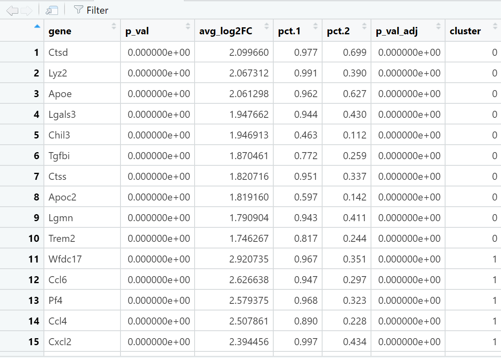
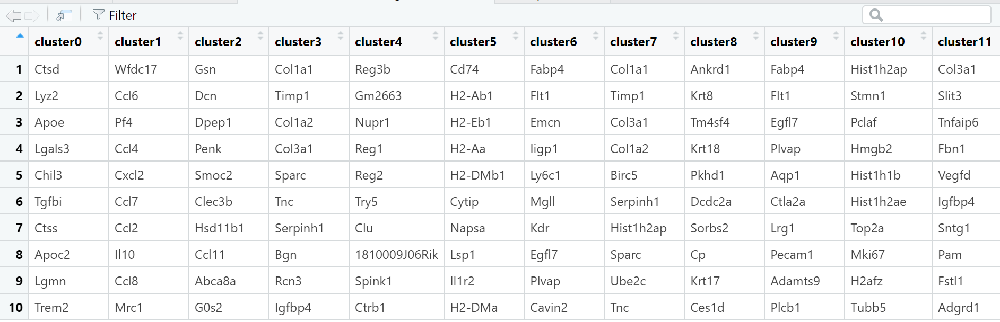
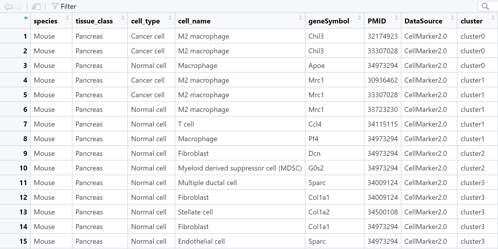
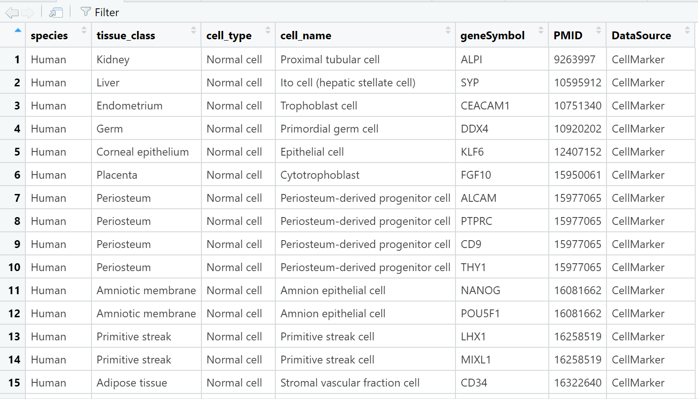
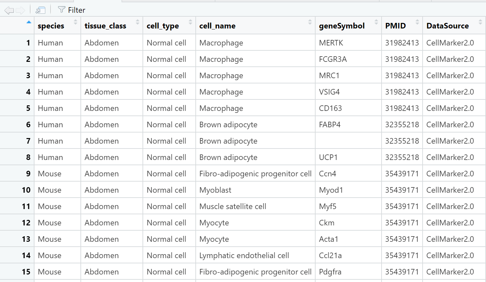
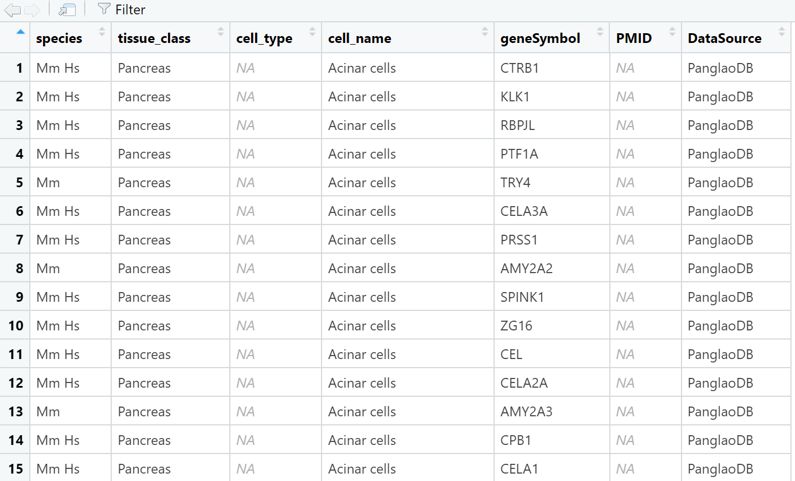
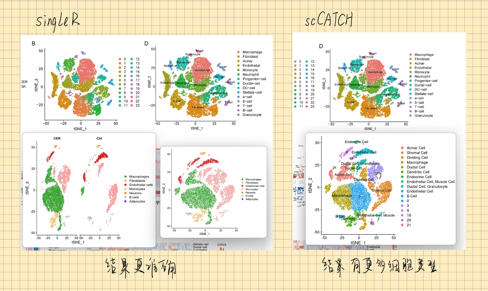

## DXMarkers: A tool for rapidly extracting markers from the "CellMarker", "CellMarker2.0", and "PanglaoDB" databases

DXMarkers is a meticulously designed R package with the aim of providing more efficient tools for manual cell type annotation in single-cell sequencing (scRNA-seq) analysis. It leverages highly expressed genes specific to particular cell types, also known as "Markers," which can be efficiently retrieved from three widely recognized Cell Marker databases: "CellMarker," "CellMarker2.0," and "PanglaoDB." Moreover, DXMarkers offers functionality to filter search results by species and tissue type, enabling users to obtain more accurate information during the process.


## Installation Guide

DXMarkers supports various installation methods, including GitHub, Gitee, and local installation.

### GitHub Installation

Before installing the DXMarkers package from GitHub, make sure that the `devtools` package has been installed. If not yet installed, you can install it using `install.packages("devtools")`. After that, install DXMarkers by executing the following command:

``` r
library(devtools)
install_github("DaXuanGarden/DXMarkers")
```

### Gitee Installation

To install the DXMarkers package on Gitee, you first need to install the `remotes` package, which can be installed through `install.packages("remotes")`. Then, install from Gitee using the following command:

``` r
remotes::install_git('https://gitee.com/DaXuanGarden/dxmarkers')
```

### Local Installation

For local installation, you need to specify the local path of the R package. First, set the working path, then load the `devtools` package to install:

``` r
setwd("/home/data/t050446/01 Single Cell Project/Acute Pancreatitis")
library(devtools)
install_local("/home/data/t050446/Non-tumor research/DXMarkers_1.0.tar.gz")
```

If you wish to obtain the R package file for local installation, you can follow the official account "大轩的成长花园" (Garden of Da Xuan) and leave a message mentioning "DXMarkers." Da Xuan will promptly send you the packaged installation file. By following the provided instructions, you can quickly install DXMarkers and use it for batch querying of markers, assisting you in your single-cell analysis.

## Preparation before use

Before we use the R package for Marker retrieval, we first need to process and analyze single-cell data.

1.  **Load raw data**：This step is to load the raw gene expression matrix into the R environment, where rows typically represent genes and columns represent cells.

2.  **Create a Seurat object**：Seurat is an R package for single-cell RNA-seq data analysis. We first need to create a Seurat object to store and manipulate the data.

3.  **Data preprocessing and quality control**：In this step, we will remove cells with too few or too many expressed genes, as well as cells with a high proportion of mitochondrial genes.

4.  **Data normalization**：This step normalizes the gene expression level of each cell by its total expression, to eliminate technical variations between cells.

5.  **Find highly variable genes**：Highly variable genes are genes that show large differences in expression levels among different cells. These genes can be used to distinguish different cell types.

6.  **Data scaling and linear dimension reduction**：This step is to reduce the dimensionality of the data for subsequent clustering analysis.

7.  **Cell clustering**：Group cells with similar gene expression patterns together.

8.  **Non-linear dimension reduction**：Non-linear dimension reduction techniques such as t-SNE or UMAP can help us visualize high-dimensional single-cell data on a two-dimensional plane.

9.  **Plotting clustering results**：Plot each cell on a two-dimensional plane according to its clustering results, to observe the distribution of different cell populations.

10. **Finding marker genes**：Marker genes are used to identify specific cell populations, and their expression levels are significantly higher in that cell population than in other cell populations.

-   The following is a sample code that demonstrates how to process single-cell data using the Seurat library.

    ``` r
    # Manual Annotation
    # Load Seurat library
    library(Seurat)
    # Load data
    scRNA <- readRDS(file = "scRNA.rds")
    # Find markers for all clusters
    scRNA.markers <- FindAllMarkers(scRNA, only.pos = TRUE, min.pct = 0.25, logfc.threshold = 0.25)
    # Filter out genes with p_val < 0.05
    all.markers <- scRNA.markers %>%
    dplyr::select(gene, everything()) %>%
    dplyr::filter(p_val < 0.05)
    # Select top 10 genes by avg_log2FC
    top10 <- all.markers %>%
    group_by(cluster) %>%
    top_n(n = 10, wt = avg_log2FC)
    # Write out the results, output genes with p_val < 0.05
    write.csv(all.markers, file = "all_markers.csv", row.names = FALSE)
    # Output top 10 genes by avg_log2FC
    write.csv(top10, file = "top10_genes.csv", row.names = FALSE)
    # Draw heatmap of top 10 marker genes
    DoHeatmap(scRNA, features = top10$gene)
    # Draw violin plot of top 20 marker genes
    VlnPlot(scRNA, features = top10$gene[1:20], pt.size = 0)
    # Draw dimensionality reduction plot
    DimPlot(scRNA, label = TRUE, reduction = "tsne")
    ```

After the data is read and processed as described above, you will obtain a list of markers related to single-cell data. This list serves as the initial input file for DXMarkers.

## Data Processing

Process data using the `reshape_genes_wide` function in DXMarkers, then save the result to a file:

``` r
library(DXMarkers)
top10_data <- read.csv("top10_genes.csv")
sorted_result <- reshape_genes_wide(top10_data)
write.csv(sorted_result, file = "top10_sorted_genes.csv", row.names = FALSE)
```



## Marker Retrieval

After the data processing, use the `annotate_markers` function in DXMarkers for one-click marker retrieval:

``` r
library(DXMarkers)
top10_genes_data <- read.csv("top10_sorted_genes.csv", stringsAsFactors = FALSE)
DXMarkers_result <- annotate_markers(top10_genes_data, "Mouse", "Pancreas")
```



## View Data Source

With the `view_data_source` function in DXMarkers, you can view the complete dataset of the built-in "CellMarker", "CellMarker2.0", or "PanglaoDB" database:

``` r
library(DXMarkers)
data_source <- "CellMarker"
data <- view_data_source(data_source = data_source)
```



    library(DXMarkers)
    data_source <- "CellMarker2.0"
    data <- view_data_source(data_source = data_source)

{width="589"}

    library(DXMarkers)
    data_source <- "PanglaoDB"
    data <- view_data_source(data_source = data_source)

{width="590"}

## Help and Feedback

DXMarkers is a meticulously designed R package with the primary goal of providing efficient tools for manual cell type annotation in single-cell sequencing (scRNA-seq) analysis. It aims to help users swiftly and accurately retrieve marker information from various databases. Whether you are a newcomer to single-cell data analysis or an experienced researcher, DXMarkers can save you time and enhance your efficiency.

If you encounter any challenges during any of the aforementioned processes or have valuable suggestions, such as the desire to include additional datasets from single-cell annotation databases, you are welcome to leave a message on the WeChat official account "Garden of Da Xuan 🐾." Da Xuan 🐾 will promptly respond to your message! Alternatively, you can also reach out to Da Xuan via email at daxuan111000\@163.com, enabling us to share knowledge, exchange insights, and grow together.

👀 For those interested in adding more datasets from single-cell annotation databases, kindly send an email or leave a message on the official account "Garden of Da Xuan 🐾" in the format "Database Name + Website + Screenshot of the Download Button." This ensures that the relevant database supports the download of all annotation data. Da Xuan 🐾 warmly welcomes everyone to provide constructive suggestions and contribute additional datasets, further enhancing the comprehensiveness and reliability of DXMarkers. Hehe! We look forward to your messages! 😀 Keep up the good work!

## Da Xuan's Thoughts

Hehe! You can begin with using automated annotation software like scCATCH and SingleR to gain a general understanding of possible cell types. Then, utilize DXMarkers for manual annotation! 🎉

For those seeking more assistance with SingleR and scCATCH, feel free to reach out and leave a message for Da Xuan 🐾. Of course, Da Xuan is also excited to learn about better automated annotation tools from you! We await your contributions!

Below are the results of Da Xuan using SingleR and scCATCH for automated annotation, which you may find helpful:

## Development Journey

Hey! It all started when I was manually annotating cells and realized that searching databases one by one and manually copying and pasting information into Excel was too time-consuming. After seeking advice from several research groups and conducting searches on WeChat official accounts, Google, Bing, Baidu, and other search engines, I discovered a lack of a quick and batch querying tool like this. So, I decided to write functions and create an R package to enable fast and batch querying of cell types associated with markers.

Please note that, similar to many existing automated annotation tools, DXMarkers cannot fully replace the actions of manually querying databases and studying marker biology through scientific literature. Its purpose is to serve as an auxiliary tool to boost cell annotation efficiency.

This is my first time creating an R package, and there might be room for improvement. I sincerely appreciate everyone's understanding and invitation to offer valuable suggestions, aiding in Da Xuan's rapid growth!

## References

1.  [如何快速写一个R包 \| KeepNotes blog (bioinfo-scrounger.com)](https://www.bioinfo-scrounger.com/archives/546/)

2.  OpenAI. (2021). ChatGPT (Version GPT-3.5 architecture). Retrieved from [**https://openai.com/chatgpt/**](https://openai.com/chatgpt/).

3.  <https://blog.csdn.net/lxd13699/article/details/122384935>

4.  <https://www.cnblogs.com/nkwy2012/p/9066370.html>

5.  <https://www.runoob.com/git/git-commit.html>

6.  [使用 git 命令行上传项目到 GitHub（以 R 包为例）](https://mp.weixin.qq.com/s/V5UGGAYiJFNicX4yjaBDsA)
