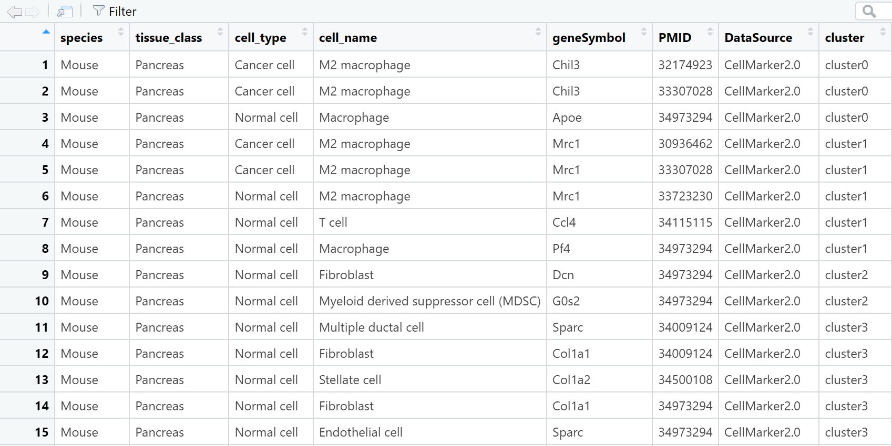
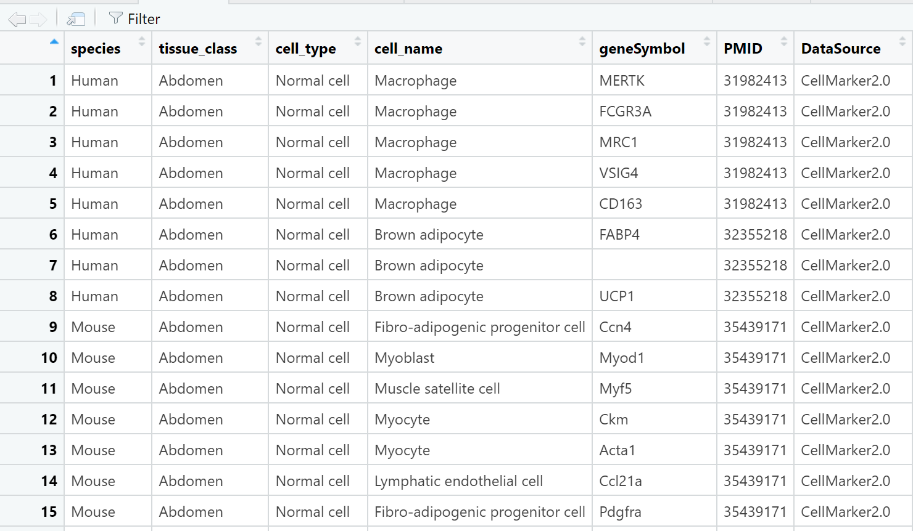
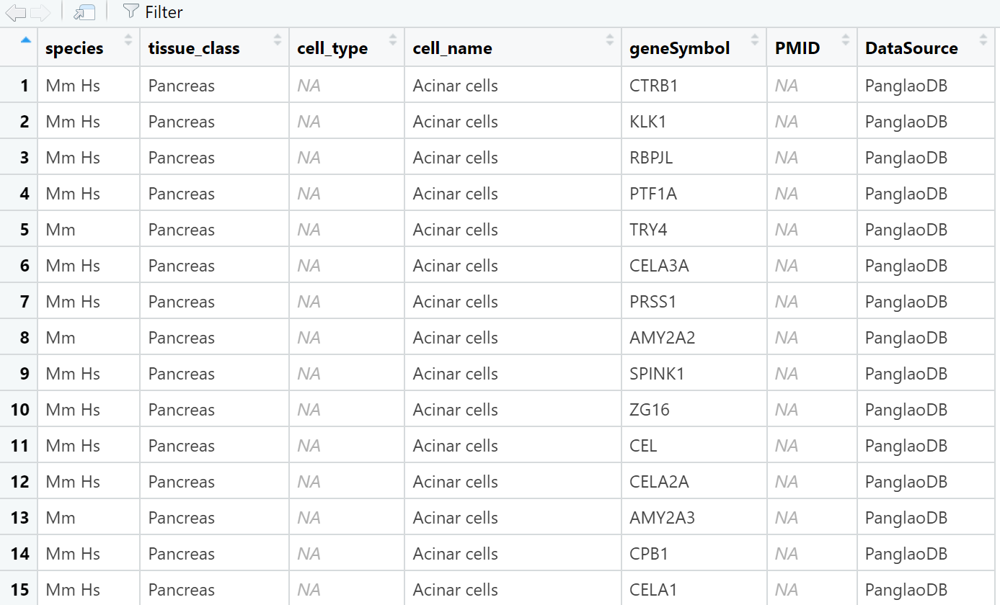
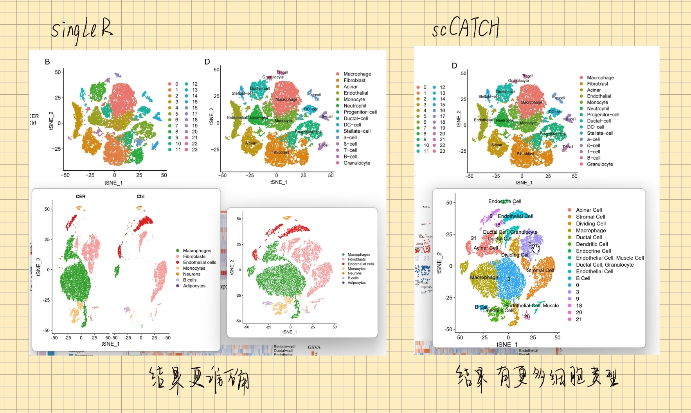

## DXMarkers：用于快速提取 "CellMarker"、"CellMarker2.0" 和 "PanglaoDB" 数据库中的Marker的工具

DXMarkers 是一款精心设计的 R 包，其目标是在单细胞测序(scRNA-seq)分析中手动注释细胞类型时 中提供更高效的工具来区分细胞类型。它利用在特定细胞类型中高表达的基因 - 也称为 Marker，可以在 "CellMarker"、"CellMarker2.0" 和 "PanglaoDB" 这三个主流的 Cell Marker 数据库中进行高效的检索。除此之外，DXMarkers 提供了按物种和组织类型筛选搜索结果的功能，从而可以为用户提供更为精准的信息。

## 安装指南

DXMarkers 支持多种安装方式，包括 GitHub、Gitee 和本地安装。

### GitHub安装

在从 GitHub 安装 DXMarkers 包之前，确保已经安装了 `devtools` 包。如尚未安装，可以使用 `install.packages("devtools")` 进行安装。安装完毕后，通过执行以下命令安装 DXMarkers：

    library(devtools)
    install_github("DaXuanGarden/DXMarkers")

### Gitee安装

在 Gitee 上安装 DXMarkers 包，首先需要安装 `remotes` 包，通过 `install.packages("remotes")` 进行安装。然后，通过以下命令从 Gitee 安装：

    remotes::install_git('https://gitee.com/DaXuanGarden/dxmarkers')

### 本地安装

如果选择本地安装，你需要指定 R 包的本地路径。首先设定工作路径，然后加载 `devtools` 包进行安装：

    setwd("/home/data")
    library(devtools)
    install_local("DXMarkers_1.0.tar.gz")

如果你希望获得支持本地安装的R包文件，你可以关注公众号`大轩的成长花园`并留言`DXMarkers`，大轩会立刻把打包好的安装包发给你。你可以快速按照如上方式安装`DXMarkers`来帮助你进行Marker的批量查询。

## 使用前准备

在使用R包进行Marker检索之前，我们需要先对单细胞数据进行处理与分析。

1.  **加载原始数据**：这一步是将原始的基因表达矩阵加载到R环境中，行通常代表基因，列代表细胞。

2.  **创建Seurat对象**：Seurat是一款R包，可以用来分析单细胞RNA测序数据。我们需要先创建一个Seurat对象，用来储存和操作数据。

3.  **数据预处理与质量控制**：在此步骤中，我们会移除表达基因过少或过多的细胞，以及含有过多线粒体基因的细胞。

4.  **数据归一化**：这一步将每个细胞的基因表达量按照其总表达量进行归一化，以消除细胞间的技术差异。

5.  **寻找高变异基因**：高变异基因是在不同细胞中表达量差异大的基因，这些基因可以用来区分不同的细胞类型。

6.  **数据缩放和线性降维**：这一步是为了减少数据的维度，以便进行后续的聚类分析。

7.  **细胞聚类**：将具有相似基因表达模式的细胞聚集在一起。

8.  **非线性降维**：非线性降维（如t-SNE或UMAP）可以帮助我们在二维平面上可视化高维的单细胞数据。

9.  **绘制聚类结果**：将每个细胞根据其聚类结果绘制在二维平面上，以观察不同细胞群体的分布。

10. **寻找标记基因**：标记基因是用来标识特定细胞群体的基因，其在该细胞群体中的表达量要明显高于其他细胞群体。

-   下面是一段示例代码，它展示了如何寻找Marker并筛选到每个cluster排名前十的Marker。

<!-- -->

    # 手动注释
    # 加载Seurat库
    library(Seurat)
    # 加载数据 ###数据已经经过上述全部操作。
    scRNA <- readRDS(file = "scRNA.rds")
    # 寻找所有聚类的标记基因
    scRNA.markers <- FindAllMarkers(scRNA, only.pos = TRUE, min.pct = 0.25, logfc.threshold = 0.25)
    # 筛选p_val<0.05的基因
    all.markers <- scRNA.markers %>%
      dplyr::select(gene, everything()) %>%
      dplyr::filter(p_val < 0.05)
    # 将avg_log2FC排名前10的基因筛选出来
    top10 <- all.markers %>%
      group_by(cluster) %>%
      top_n(n = 10, wt = avg_log2FC)
    # 输出筛选结果，输出p_val<0.05的基因
    write.csv(all.markers, file = "all_markers.csv", row.names = FALSE)
    # 输出avg_log2FC排名前10的基因
    write.csv(top10, file = "top10_genes.csv", row.names = FALSE)
    # 绘制前10个标记基因的热图
    DoHeatmap(scRNA, features = top10$gene)
    # 绘制前20个标记基因的小提琴图
    VlnPlot(scRNA, features = top10$gene[1:20], pt.size = 0)
    # 绘制降维图
    DimPlot(scRNA, label = TRUE, reduction = "tsne")

在上述数据读取与处理后，你会得到单细胞数据关于Marker的列表，这是`DXMarkers`的**最初的**输入文件。

{width="13.8cm" height="8.9cm"}

## 数据处理

使用 DXMarkers 的 `reshape_genes_wide` 函数进行数据处理，然后将结果保存到文件：

``` r
library(DXMarkers)
top10_data <- read.csv("top10_genes.csv")
sorted_result <- reshape_genes_wide(top10_data)
write.csv(sorted_result, file = "top10_sorted_genes.csv", row.names = FALSE)
```


## 检索 Marker

在完成数据处理后，使用 DXMarkers 的 `annotate_markers` 函数进行一键式检索 Marker：

``` r
library(DXMarkers)
top10_genes_data <- read.csv("top10_sorted_genes.csv", stringsAsFactors = FALSE)
DXMarkers_result <- annotate_markers(top10_genes_data, "Mouse", "Pancreas")
```



## 查看数据源

使用 DXMarkers 的 `view_data_source` 函数，你可以查看内建的 "CellMarker"、"CellMarker2.0" 或 "PanglaoDB" 数据库的完整数据集：

``` r
library(DXMarkers)
data_source <- "CellMarker"
data <- view_data_source(data_source = data_source)
```

{width="591"}

    library(DXMarkers)
    data_source <- "CellMarker2.0"
    data <- view_data_source(data_source = data_source)

{width="589"}

    library(DXMarkers)
    data_source <- "PanglaoDB"
    data <- view_data_source(data_source = data_source)

{width="590"}

## 帮助与反馈

DXMarkers 的主要目标是提供在处理大量单细胞手动注释细胞类型时的有效工具，帮助用户快速准确地检索各数据库中的 Marker 信息。无论你是单细胞数据分析的新手，还是经验丰富的研究者，DXMarkers 都能帮你节省时间，提高效率。

如果你在上述任何一个环节遇到问题，或者你有更好建议，比如你希望添加更多*单细胞注释数据库的数据集*，都可以在微信公众号`大轩的成长花园`留言，大轩🐾会在看到留言后及时回复你哦！当然，你也可以发邮件给大轩，大轩的邮箱：daxuan111000\@163.com，让我们分享彼此的知识，交流彼此的心得，共同成长。

👀如果希望增加更多单细胞注释数据库的数据集，请在确保相关数据库支持下载全部注释数据的前提下，以`“数据库名称+网址+下载按钮的截图”`的形式发邮箱或公众号留言给大轩🐾。大轩🐾非常欢迎大家为`DXMarkers`提供更多建设性建议并且能够增加更多数据集来使我们的结果更加全面可靠。嘻嘻！期待你的留言！😀加油鸭！

## 大轩碎碎念

嘻嘻！你可以先使用自动注释软件，比如`scCATCH`、`SingleR`来进行自动注释，大致了解一下可能的细胞类型，然后再使用`DXMarkers`进行手动注释呦！🎉

如果你希望获得关于使用`SingleR`、`scCATCH`的更多帮助，同样可以给大轩🐾留言。当然，大轩也非常期待你能有更好的自动注释工具给大轩🐾分享！期待你的分享！

下面是大轩使用`SingleR`、`scCATCH`的自动注释的结果，你可以参考：

## 开发历程

嘿嘿！其实只是在细胞手动注释的过程中，感觉一个一个到数据库里面查询然后在手动复制粘贴到Excel中太消耗时间。在一些科研交流群里面请教了许多，在微信公众号和谷歌、Bing、百度等搜索引擎里面搜索很多后，发现正好缺少这样的快速批量的查询工具。 于是，便自己尝试写函数写R包，方便快速批量查询Marker对应的细胞类型。

请注意，与已知的很多自动注释工具相同，`DXMarkers`并不能完全代替手动查询数据库、查阅SCI英文文献来考察Marker的生物学背景的动作，仅仅作为提高细胞注释效率的辅助手段。

这是大轩第一次写R包，很多内容可能并不完美，非常感谢大家的包容并且邀请大家一起提出宝贵建议，让大轩能够尽快成长起来！


## 参考资料

1.  [如何快速写一个R包 \| KeepNotes blog (bioinfo-scrounger.com)](https://www.bioinfo-scrounger.com/archives/546/)

2.  OpenAI. (2021). ChatGPT (Version GPT-3.5 architecture). Retrieved from [**https://openai.com/chatgpt/**](https://openai.com/chatgpt/).

3.  <https://blog.csdn.net/lxd13699/article/details/122384935>

4.  <https://www.cnblogs.com/nkwy2012/p/9066370.html>

5.  <https://www.runoob.com/git/git-commit.html>

6.  [使用 git 命令行上传项目到 GitHub（以 R 包为例）](https://mp.weixin.qq.com/s/V5UGGAYiJFNicX4yjaBDsA)

7.  [手把手教你做单细胞测序数据分析\|5.细胞类型注释，从入门到入土](https://mp.weixin.qq.com/s/qQUfTTYOCUTbKNZiMOibVg)

8.   CellMarker：[[http://xteam.xbio.top/CellMarker/](http://xteam.xbio.top/CellMarker/)](http://xteam.xbio.top/CellMarker/](http://xteam.xbio.top/CellMarker/))

9.  CellMarker2.0：[[http://117.50.127.228/CellMarker/](http://117.50.127.228/CellMarker/)](http://117.50.127.228/CellMarker/](http://117.50.127.228/CellMarker/))

10. PanglaoDB：[[https://panglaodb.se/index.html](https://panglaodb.se/index.html)](https://panglaodb.se/index.html](https://panglaodb.se/index.html))

    ## 写在最后

    

    > 显然，目前DXMarkers的功能并不强大，相关函数代码也十分简单（虽然但是，光打包成R包的报错我调试了两天两夜呜呜呜😭）。但是我们仍然可以继续进一步开发更强大实用的功能，比如加入**AI算法**，降低人为判断的主观性，进而开发自动注释细胞类型的功能。
    >
    > 关于此，我向你发出邀请，如果你有相关建议或者技术，欢迎进一步交流！嘻嘻！我还是比较菜的，但是实现起来还是可期的。
